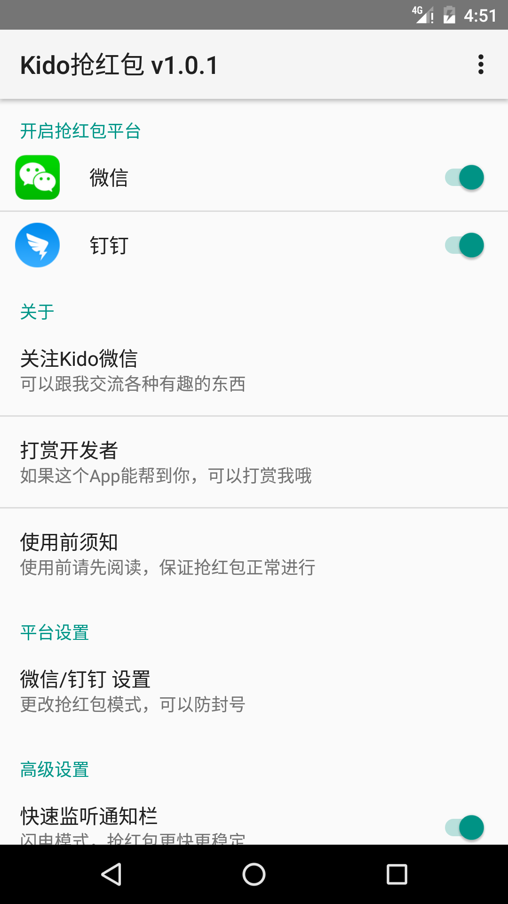
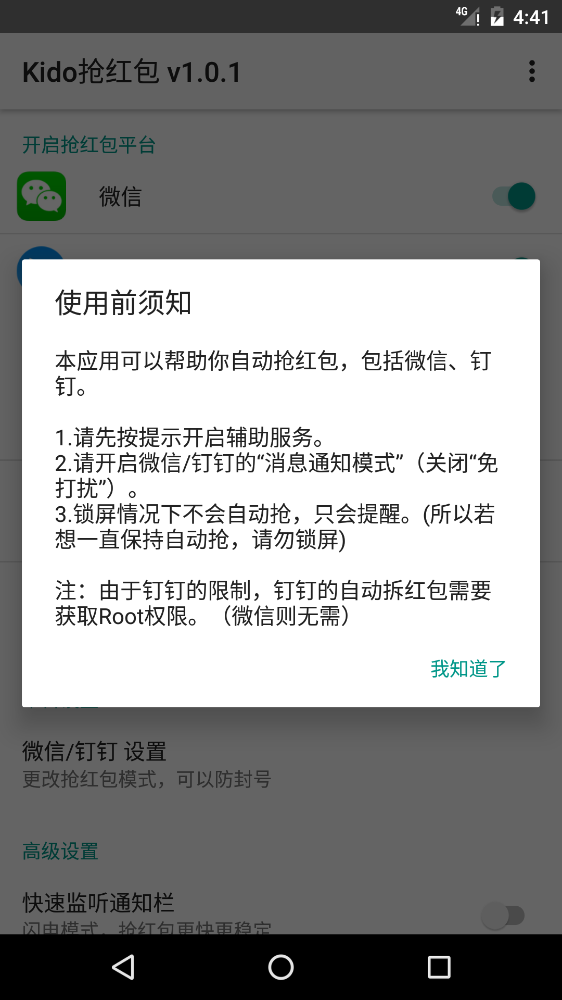
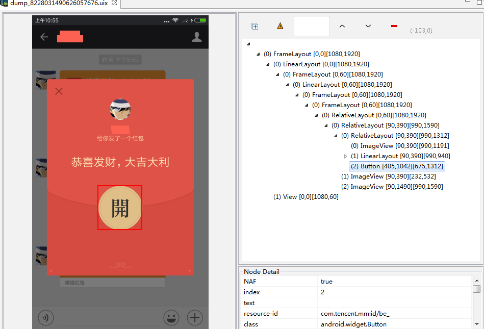
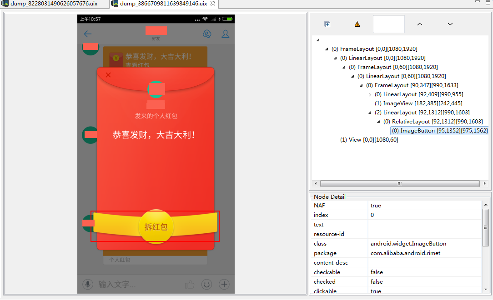

#Kido抢红包外挂

> 本应用参(抄)考(袭)[CodeBoy的微信抢红包](https://github.com/lendylongli/qianghongbao)(利用AccessibilityService辅助功能)，在其基础上加入了钉钉抢红包，同时做了一些小整改。可以帮助你自动抢微信红包、钉钉红包。

## 自动抢红包大致流程

 1. 捕捉notification的消息文本，有对应文本则打开应用。
 2. 在消息列表的时候，捕捉消息列表的文本，有对应文本则进入聊天界面。
 3. 在聊天界面的时候，捕捉红包上面的特定文本，有对应文本则点击进入拆红包界面。
 4. 在拆红包界面的时候，获取拆红包那个节点，执行模拟点击。

## 使用前须知

 1. 请先按提示开启辅助服务。
 2. 请开启微信/钉钉的“消息通知模式”（关闭“免打扰”）。
 3. 锁屏情况下不会自动抢，只会提醒。(所以若想一直保持自动抢，请勿锁屏)
 4. **注：**由于钉钉的限制，钉钉的自动拆红包需要获取Root权限。（微信则无需）

## 应用截图




## 其它
### 特殊处理：

由于钉钉获取到的拆红包节点ImageButton无法定位到中间那个“拆红包”，所以无法直接通过Node的performClick执行模拟点击。以下是微信的“拆红包”和钉钉的“拆红包”:






所以此处做的处理是获取Root执行点击的命令，这里针对钉钉做出的特殊处理，应该算是本应用的**一大败笔**。

```java

    private final static String FORMAT_CMD_TAP = "input tap %1$s %2$s";

    /**
     * 执行shell命令
     *
     * @param cmd
     */
    public static void execShellCmd(String cmd) {

        try {
            // 申请获取root权限，这一步很重要，不然会没有作用
            Process process = Runtime.getRuntime().exec("su");
            // 获取输出流
            OutputStream outputStream = process.getOutputStream();
            DataOutputStream dataOutputStream = new DataOutputStream(outputStream);
            dataOutputStream.writeBytes(cmd);
            dataOutputStream.flush();
            dataOutputStream.close();
            outputStream.close();
        } catch (Throwable t) {
            t.printStackTrace();
        }
    }

    /**
     * 执行点击
     *
     * @param posX 相对屏幕的x轴
     * @param posY 相对屏幕的y轴
     */
    public static void execTap(int posX, int posY) {
        String cmd = String.format(FORMAT_CMD_TAP, posX, posY);
        execShellCmd(cmd);
    }

```

### 下载地址

 - [源码下载地址](https://github.com/xuguobiao/KidoQHB)
 
 - [apk下载地址](https://fir.im/kidoQHB)
